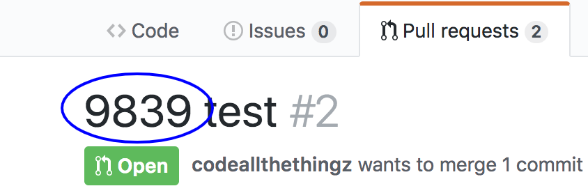

# asana-github-pr-webhook

[](https://circleci.com/gh/codeallthethingz/asana-github-pr-webhook/tree/master)
[](https://standardjs.com)

Connects Github and Asana.

## Usage

Use the last 4 digits of an Asana task ID at the beginning of a PR name.



See a link to the PR appear as a comment on that task in Asana.


See a link to the Asana task appear as a comment on the PR.


## Installation

### 1. Get an Asana access token

- To get an access token go to 'My Profile Settings' -> Apps -> 'Manage Developer Apps' -> 'Create new personal access token'.
- Make a note of the access token as you'll need it later on. `<asana access token>`

### 2. Get an Github access token

- To get an access token go to 'Settings' -> 'Developer Settings' -> 'Personal Access Token' -> 'Generate new token'.
- Under 'scopes' select 'Repo'.
- Make a note of the access token as you'll need it later on. `<github access token>`

### 3. Deploy the application

This project uses Zeit Now to deploy, which requires only a github account and gives you 2 million free invocations a month.

- Create a long, random password that we'll refer to as `<webhook secret>`
- Fork this repo and download it.
- Change the `now.json` config to choose a different alias as you won't be able to use the default.  We'll refer to this URL as `<url>`
- Run `npm init`
- Run 
    ```bash
    now \
      -e WEBHOOK_SECRET="<webhook secret>" \
      -e ASANA_ACCESS_TOKEN="<asana access token from step 1>"\
      -e GITHUB_ACCESS_TOKEN="<github access token from step 2>"
    ```
- Run `now alias` to set the non-changing URL that we can use in step 3.

### 4. Setup webhooks in Github

- For the github project you want to integrate, go to settings -> webhooks -> add a new webhook.
- Set the Payload URL to `https://<url from step 2>/webhook.js`
- Set the content type to `application/json`
- Set the secret to `<webhook secret>`
- Set the events to 'Let me select individual events' and check the box next to 'Pull Requests'
- Save.

Phew, everything should work.
